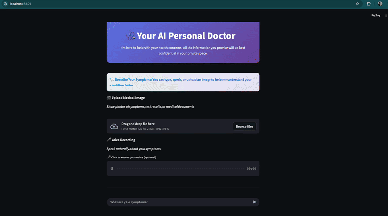

# Personal Doctor AI Assistant with Streaming Text-to-Speech



*Multimodal AI assistant supporting text, voice, and image inputs for health consultations*


A local, privacy-preserving multimodal AI assistant for personal health education and triage support using [MedGemma](https://deepmind.google/models/gemma/medgemma/). This tool runs entirely on your local machine, ensuring that your data remains private.


## Core Principles

This project is governed by a strict constitution that prioritizes user safety and privacy.
-   **Privacy First**: All data, including user queries and images, remains on the user's local machine. No data is sent to any external cloud service.
-   **Safety by Design**: The assistant is an educational tool, not a medical professional. It includes prominent disclaimers and its triage logic is designed to err on the side of caution.
-   **Local-First Execution**: The core functionality (AI model, backend, and UI) operates entirely on the user's machine.

## Features

The assistant supports multiple modes of interaction for discussing symptoms and seeking health information:
-   **Symptom Inquiry via Text**: Ask health-related questions through a standard chat interface.
-   **Symptom Inquiry with Image Upload**: Upload an image of a visual symptom (e.g., a skin rash) for more contextual information.
    -   **Voice-to-Text**: Interact with the assistant using your voice, with transcription handled by the backend service.

-   **Streaming Text Summary with Audio Playback**: When clicking 'Play Audio Summary', a concise summary of the AI's response streams onto the screen, followed by automatic audio playback of that summary. This provides quick visual and auditory consumption of key information.
-   **Real-time Audio Responses (Streaming TTS)**: Hear the AI's full responses in real-time if a direct audio response is generated (distinct from the summary).
-   **Educational Content**: Receive information about potential causes, at-home care, and guidance on when to seek professional help.

## Tech Stack

-   **AI Model**: `MedGemma-4B` served locally via `Ollama`.
-   **Backend**: `FastAPI` (Python 3.11+), incorporating `LiteLLM` for LLM integrations, and dedicated audio services (`Coqui TTS` for Text-to-Speech, `Whisper` for Voice-to-Text).
-   **Frontend**: `Streamlit` (Python 3.11+), `streamlit-webrtc`, `scipy`
-   **Package Management**: `uv`

## Development Process

This project is built using a spec-driven development process facilitated by the [`speckit`](https://github.com/github/spec-kit) and [`gemini-cli`](https://github.com/google-gemini/gemini-cli) tools. All features are formally specified, planned, and tasked before implementation.

## Setup

### Prerequisites

-   **Python 3.11+**
-   **`uv` Package Manager**: If you don't have it, install it:
    ```bash
    pip install uv
    ```
-   **Ollama**: Must be installed and running.
-   **MedGemma Model**: 
    Pull the required model via Ollama:
    ```bash
    ollama pull amsaravi/medgemma-4b-it:q6
    ```

    Test the model on the CLI:
    ```bash
    ollama run amsaravi/medgemma-4b-it:q6
    ```
-   **ffmpeg and other audio/build dependencies**: Required for audio processing by Whisper and Coqui TTS. For Docker builds, `build-essential`, `libsndfile1`, and `espeak-ng` are also needed.
    -   **macOS (using Homebrew)**: `brew install ffmpeg`
    -   **Linux (using apt)**: `sudo apt update && sudo apt install ffmpeg build-essential libsndfile1 espeak-ng`
    -   **Windows**: Download from the official ffmpeg website.

### Installation

1.  **Clone the repository**:
    ```bash
    git clone <repository-url>
    cd personal-doctor
    ```

2.  **Set up the backend**:
    ```bash
    cd backend
    uv venv
    source .venv/bin/activate
    uv pip install -r requirements.txt
    ```

3.  **Set up the frontend**:
    ```bash
    cd ../frontend
    uv venv
    source .venv/bin/activate
    uv pip install -r requirements.txt
    ```

## Running the Application

1.  **Start the backend server**:
    Open a terminal, navigate to the `backend` directory, and run:
    ```bash
    source .venv/bin/activate
    uvicorn src.main:app --reload
    ```
    The backend API will be available at `http://127.0.0.1:8000`.

2.  **Start the frontend application**:
    Open a second terminal, navigate to the `frontend` directory, and run:
    ```bash
    source .venv/bin/activate
    streamlit run src/app.py
    ```
    The Streamlit UI will open in your browser at `http://localhost:8501`.

### Running the Backend with Docker (Alternative)

As an alternative to running the backend directly, you can use Docker.

1.  **Build the Docker image**:
    Navigate to the `backend` directory and run:
    ```bash
    docker build -t personal-doctor-backend .
    ```

2.  **Run the Docker container**:
    ```bash
    docker run -d -p 8000:8000 -e OLLAMA_HOST=http://host.docker.internal:11434 --name personal-doctor-backend-container personal-doctor-backend
    ```
    The backend API will be available at `http://127.0.0.1:8000`.

    > **Note**: `host.docker.internal` is a special DNS name that resolves to the internal IP address of the host machine. This is necessary for the container to communicate with the Ollama service running on your local machine.

## Usage

1.  Open your web browser and navigate to `http://localhost:8501`.
2.  Type a health-related question into the chat input box.
3.  Optionally, use the file uploader to attach an image related to your query.
4.  Press Enter or click the submit button to get a response from the AI assistant.
5.  Click the "Play Audio Summary" button. A text summary will stream onto the screen, followed by the automatic audio playback of that summary.

---

## Disclaimer

This AI assistant is for educational and informational purposes only and is not a substitute for professional medical advice, diagnosis, or treatment. Always seek the advice of your physician or other qualified health provider with any questions you may have regarding a medical condition. Never disregard professional medical advice or delay in seeking it because of something you have read or heard from this application.