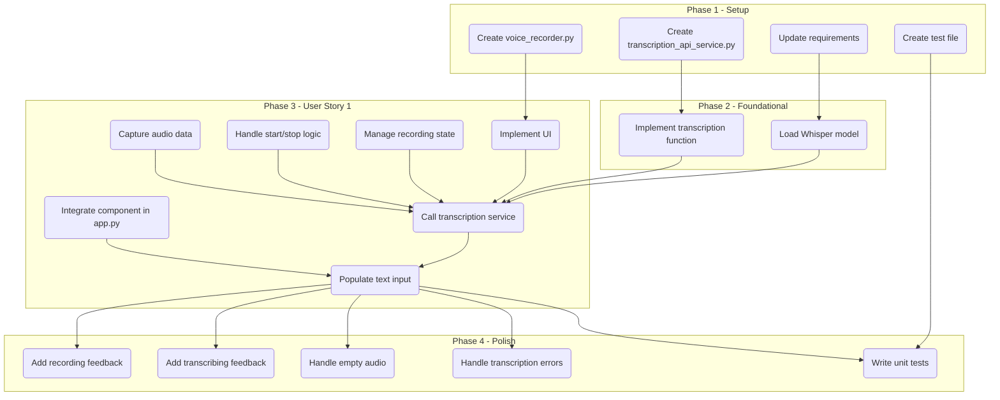

# Tasks for Feature: Voice-to-Text Input

This document outlines the actionable tasks to implement the Voice-to-Text Input feature, based on the design and research artifacts.

## Phase 1: Setup

- [x] T001 Update `frontend/requirements.txt` to include the `openai-whisper` library.
- [x] T002 Create a new file for the UI component: `frontend/src/components/voice_recorder.py`.
- [x] T003 Create a new file for the transcription service: `frontend/src/services/transcription_api_service.py`.
- [x] T004 Create a new test file: `frontend/tests/test_voice_recorder.py`.

## Phase 2: Foundational Tasks

- [x] T005 [P] In `frontend/src/services/transcription_api_service.py`, implement a function to load the fine-tuned Whisper model. This should handle model download and caching to avoid reloading on every app run.
- [x] T006 [P] In `frontend/src/services/transcription_api_service.py`, implement the core transcription function that takes raw audio data as input and returns the transcribed text.

## Phase 3: User Story 1 - Transcribe voice input for AI assistant

**Goal**: As a user, I want to tap a button to record my voice, speak a question in English or Bahasa Indonesia, and see the transcribed text in the input field.
**Independent Test**: Can be tested by running the Streamlit app, recording a phrase, and verifying the correct text appears in the input field.

- [x] T007 [US1] In `frontend/src/components/voice_recorder.py`, implement the UI for the voice recorder. This includes using `st.empty()` or a similar mechanism to manage the state of the microphone button (idle, recording, transcribing).
- [x] T008 [US1] In `frontend/src/components/voice_recorder.py`, use a session state variable to track the recording status (e.g., `st.session_state['is_recording']`).
- [x] T009 [US1] In `frontend/src/components/voice_recorder.py`, implement the logic to start and stop recording when the microphone button is clicked.
- [x] T010 [US1] In `frontend/src/components/voice_recorder.py`, capture the audio data from the user's microphone.
- [x] T011 [US1] In `frontend/srcs/components/voice_recorder.py`, once the recording is stopped, call the transcription service with the captured audio data.
- [x] T012 [US1] In `frontend/src/app.py`, integrate the `voice_recorder` component into the main application layout, placing it near the text input field.
- [x] T013 [US1] In `frontend/src/app.py`, ensure the transcribed text from the voice recorder component is populated into the main text input field.

## Phase 4: Polish & Cross-Cutting Concerns

- [x] T014 [P] In `frontend/src/components/voice_recorder.py`, add visual feedback to the microphone button to indicate when recording is active (e.g., change color, icon, or show a pulsating animation).
- [x] T015 [P] In `frontend/src/components/voice_recorder.py`, display a spinner or "Transcribing..." message while waiting for the transcription service to return the text.
- [x] T016 In `frontend/src/components/voice_recorder.py`, handle the edge case where no audio is detected, showing a notification to the user.
- [x] T017 In `frontend/src/components/voice_recorder.py`, add error handling for potential failures in the transcription service, displaying a non-blocking toast message as specified.
- [x] T018 In `frontend/tests/test_voice_recorder.py`, write unit tests for the `voice_recorder` component, mocking the transcription service to test the UI logic and state changes.
- [x] T019 In `frontend/src/components/voice_recorder.py`, implement graceful handling for microphone permission denial to satisfy FR-007.

## Dependencies

## Parallel Execution

- **Phase 2**: Tasks `T005` and `T006` can be worked on in parallel as they are in the same service file but handle different aspects (model loading vs. transcription logic).
- **Phase 3 & 4**: While the core UI logic in `voice_recorder.py` is being implemented, the integration points in `app.py` (`T012`) and the polishing tasks (`T014`, `T015`) can be prepared in parallel.

## Implementation Strategy

The suggested MVP is to complete all tasks up to the end of Phase 3. This will deliver the core functionality of voice-to-text transcription. Phase 4 tasks can be completed subsequently to enhance the user experience and robustness.